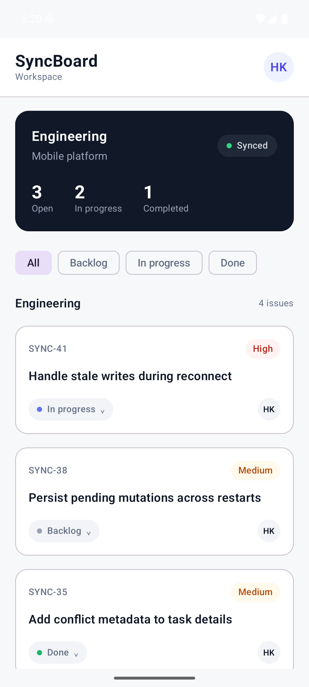
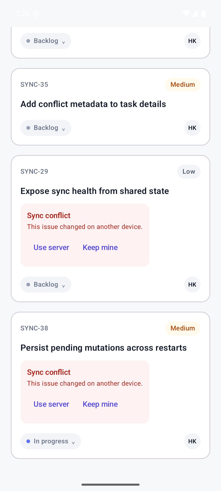
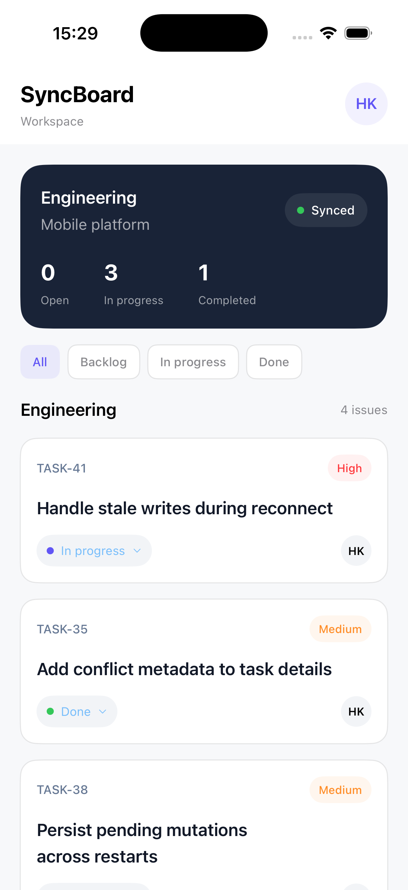
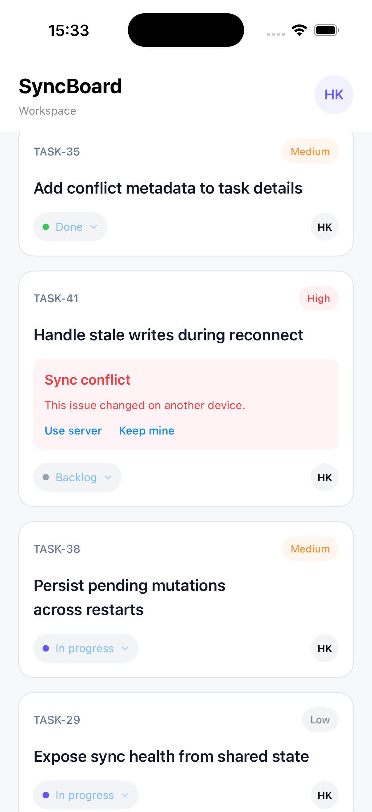
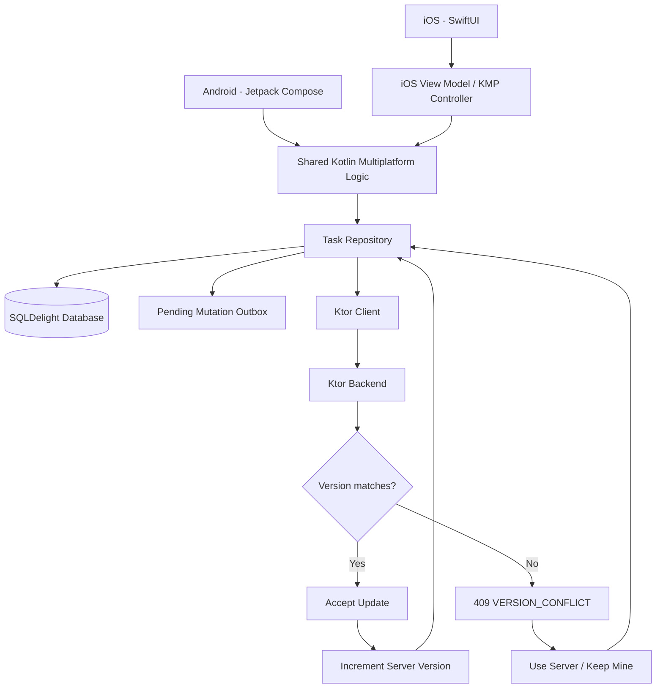
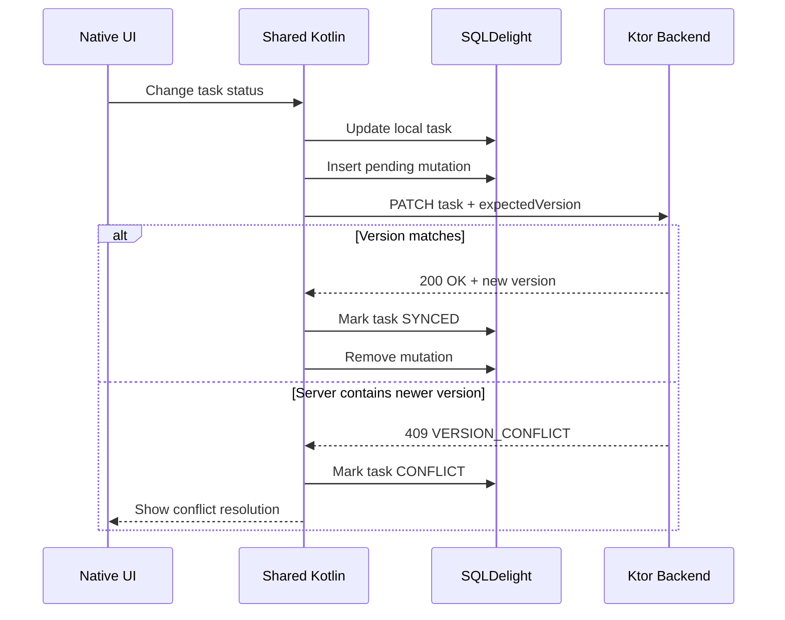

# SyncBoard

[](https://github.com/harmanpreetbuilds/syncboard-kmp/actions/workflows/ci.yml)

SyncBoard is an offline-first cross-platform task synchronization application built with Kotlin Multiplatform.

It uses native user interfaces on Android and iOS while sharing synchronization, persistence, networking, and domain logic through Kotlin.

The project focuses on a difficult real-world mobile engineering problem:

> How do you let users continue making changes when connectivity is unreliable without silently overwriting newer data from another client?

SyncBoard solves this using local-first writes, a durable mutation outbox, optimistic concurrency control, automatic retry, and explicit conflict resolution.

---

## Features

- Native Android interface with Jetpack Compose
- Native iOS interface with SwiftUI
- Shared Kotlin Multiplatform business logic
- SQLDelight persistence on Android and iOS
- Offline-first task updates
- Durable pending mutation queue
- Automatic synchronization
- Pending write recovery after application restarts
- Ktor HTTP client
- Ktor backend
- Optimistic version-based concurrency control
- HTTP `409 VERSION_CONFLICT` handling
- Explicit `Use server` conflict resolution
- Explicit `Keep mine` rebase-and-retry resolution
- Shared synchronization tests
- Backend API tests
- Android build verification
- Native iOS simulator build verification
- GitHub Actions CI for Android, backend, shared Kotlin, and iOS

---

## Demo

### Watch SyncBoard in action

The demo shows the native Android workspace, offline/conflict synchronization behavior, Keep Mine conflict resolution, and the native SwiftUI iOS client.

[](https://raw.githubusercontent.com/harmanpreetbuilds/syncboard-kmp/main/docs/demo/syncboard-demo.mp4)

[](https://raw.githubusercontent.com/harmanpreetbuilds/syncboard-kmp/main/docs/demo/syncboard-demo.mp4)

[Watch the full SyncBoard demo](https://raw.githubusercontent.com/harmanpreetbuilds/syncboard-kmp/main/docs/demo/syncboard-demo.mp4)

---

## Screenshots

### Android

| Workspace | Conflict Resolution |
|---|---|
|  |  |

### iOS

| Workspace | Conflict Resolution |
|---|---|
|  |  |

## Why SyncBoard?

A basic CRUD application usually assumes that the network is available whenever the user makes a change.

SyncBoard does not.

When a user updates a task, the change is first stored locally. A durable mutation is also recorded so that synchronization can happen separately.

This means a task change can survive:

- temporary network failures
- backend unavailability
- application restarts
- synchronization retries

If another client modifies the same task before the pending local update reaches the backend, SyncBoard detects the stale write instead of silently replacing the newer server data.

---

## Tech Stack

### Shared Kotlin Multiplatform

- Kotlin Multiplatform
- Kotlin Coroutines
- StateFlow
- Ktor Client
- kotlinx.serialization
- SQLDelight
- Koin
- Napier

### Android

- Kotlin
- Jetpack Compose
- Material 3
- SQLDelight Android Driver
- Ktor Android Client

### iOS

- Swift
- SwiftUI
- Kotlin Multiplatform framework integration
- SQLDelight Native Driver
- Ktor Darwin Client

### Backend

- Kotlin/JVM
- Ktor Server
- Netty
- kotlinx.serialization
- optimistic version validation

### Engineering

- Gradle
- Java 21
- Git
- GitHub
- GitHub Actions
- Android Emulator
- iOS Simulator
- Xcode

---

## Architecture



Android and iOS keep their native UI technologies while sharing the synchronization engine and core application behavior.

---

## Offline Synchronization Flow

When a user changes a task, SyncBoard follows an offline-first workflow:

1. The task is immediately updated in SQLDelight.
2. The task receives a `PENDING` synchronization state.
3. A durable mutation is written to the local outbox.
4. SyncBoard attempts to send the mutation to the Ktor backend.
5. The request includes the server version previously known by the client.
6. If the server accepts the update, it increments the task version.
7. The local task becomes `SYNCED`.
8. The acknowledged mutation is deleted from the outbox.

If synchronization cannot complete, the mutation remains stored locally for a later retry.

Pending mutations survive application restarts.

---

## Synchronization Sequence



---

## Optimistic Concurrency Control

Every synchronized task contains a server version.

A normal update looks like this:

```text
Client version: 3
Server version: 3

Client sends:
expectedVersion = 3

Server accepts the update.

New server version: 4
```

Now imagine another client has already updated the task:

```text
Local client version: 3
Server version: 4
```

If the stale client tries to update the task using:

```text
expectedVersion = 3
```

the server refuses the write with:

```text
HTTP 409 Conflict
VERSION_CONFLICT
```

This prevents one client from silently destroying another client's newer changes.

---

## Conflict Resolution

When SyncBoard detects a stale write, the local task enters:

```text
CONFLICT
```

The user can choose one of two strategies.

### Use server

`Use server` discards the stale pending local mutation and accepts the newest server representation.

The result is:

```text
Local task = latest server task
Sync status = SYNCED
Pending mutation = removed
```

### Keep mine

`Keep mine` preserves the user's desired local change.

SyncBoard:

1. retrieves the latest server version
2. rebases the pending mutation onto that version
3. resets its retry information
4. retries the update
5. accepts the new server response
6. updates the local version
7. marks the task as `SYNCED`
8. removes the mutation

Example:

```text
Local desired status: IN_PROGRESS
Local base version: 4

Server current version: 5
```

Initial request:

```text
expectedVersion = 4
```

Result:

```text
409 VERSION_CONFLICT
```

After selecting `Keep mine`:

```text
Mutation rebased to version 5
```

SyncBoard retries:

```text
expectedVersion = 5
```

The server accepts it:

```text
status = IN_PROGRESS
version = 6
```

The final local state becomes:

```text
IN_PROGRESS
SYNCED
version 6
```

---

## Durable Mutation Outbox

Unsynchronized changes are stored separately from task data.

Conceptually, a mutation contains:

```text
PendingMutation
├── taskId
├── operation
├── payload
├── baseVersion
└── attemptCount
```

For example:

```text
task-38
UPDATE_STATUS
IN_PROGRESS
baseVersion = 4
attemptCount = 1
```

The mutation is only removed after the backend acknowledges the update or the user chooses a resolution that discards it.

---

## Task Synchronization States

Tasks can move between synchronization states such as:

```text
SYNCED
PENDING
CONFLICT
```

### SYNCED

The local state is acknowledged by the backend.

### PENDING

A local change exists that still needs to be synchronized.

### CONFLICT

The server contains a newer version than the version used by the pending local mutation.

---

## Restart Recovery

Pending mutations are durable.

This means an unsynchronized write can survive the application closing.

A verified flow looks like:

```text
User changes task
        ↓
Task saved locally
        ↓
Mutation stored
        ↓
PENDING
        ↓
Application restarts
        ↓
Pending mutation discovered
        ↓
Synchronization retried
        ↓
Server accepts update
        ↓
SYNCED
        ↓
Mutation removed
```

This is one of the key differences between SyncBoard and a network-dependent CRUD application.

---

## Project Structure

```text
syncboard-kmp/
│
├── androidApp/
│   └── Native Android Jetpack Compose application
│
├── iosApp/
│   └── Native SwiftUI application
│
├── sharedLogic/
│   │
│   ├── src/commonMain/
│   │   ├── domain
│   │   ├── data
│   │   ├── presentation
│   │   └── SQLDelight schema
│   │
│   ├── src/androidMain/
│   ├── src/iosMain/
│   ├── src/jvmMain/
│   └── src/jvmTest/
│
├── server/
│   └── Ktor synchronization backend
│
├── gradle/
│
└── .github/workflows/
    └── Cross-platform CI pipeline
```

---

## Backend API

### Health

```text
GET /health
```

Example response:

```json
{
  "status": "ok"
}
```

### Tasks

```text
GET /tasks
```

### Update Task

```text
PATCH /tasks/{taskId}
```

Example request:

```json
{
  "status": "IN_PROGRESS",
  "expectedVersion": 3
}
```

Successful update:

```text
HTTP 200 OK
```

The server increments the task version.

Stale update:

```text
HTTP 409 Conflict
```

Example conflict response:

```json
{
  "code": "VERSION_CONFLICT",
  "message": "The task has changed since it was last synchronized.",
  "currentTask": {
    "id": "task-38",
    "status": "IN_PROGRESS",
    "version": 4
  }
}
```

---

## Running the Backend

Requirements:

- Java 21

Start the Ktor backend:

```bash
./gradlew :server:run
```

Verify:

```bash
curl http://127.0.0.1:8080/health
```

---

## Running Android

Build the debug APK:

```bash
./gradlew :androidApp:assembleDebug
```

The APK is generated under:

```text
androidApp/build/outputs/apk/debug/
```

For local development with the Android emulator and the backend running on the host machine:

```bash
adb reverse tcp:8080 tcp:8080
```

Then install the APK and launch the Android application.

---

## Building iOS

Requirements:

- macOS
- Xcode
- Java 21

Build the Kotlin framework:

```bash
./gradlew :sharedLogic:linkDebugFrameworkIosSimulatorArm64
```

Build the native SwiftUI application:

```bash
xcodebuild \
  -project iosApp/iosApp.xcodeproj \
  -scheme iosApp \
  -configuration Debug \
  -destination 'generic/platform=iOS Simulator' \
  ARCHS=arm64 \
  ONLY_ACTIVE_ARCH=YES \
  build
```

The iOS application is built as:

```text
SyncBoard.app
```

Bundle identifier:

```text
com.harmanpreetbuilds.syncboard
```

---

## Testing

SyncBoard contains automated backend and shared synchronization tests.

### Backend Tests

```bash
./gradlew :server:test
```

The backend tests cover API and task-store behavior including version conflicts.

### Shared Synchronization Tests

```bash
./gradlew :sharedLogic:jvmTest
```

The shared tests exercise repository synchronization behavior using JVM test infrastructure.

### Android Build

```bash
./gradlew :androidApp:assembleDebug
```

### Full Local Verification

```bash
./gradlew \
  :server:test \
  :sharedLogic:jvmTest \
  :androidApp:assembleDebug
```

---

## Continuous Integration

Every push and pull request targeting `main` runs the SyncBoard GitHub Actions pipeline.

The Linux job verifies:

```text
Backend tests
Shared KMP synchronization tests
Android debug build
```

The macOS job verifies:

```text
Native iOS simulator build
```

The current CI pipeline successfully builds both platform clients and runs the automated synchronization/backend tests from clean GitHub-hosted environments.

---

## Verified Scenarios

The synchronization system has been tested using Android and iOS simulator databases together with the running Ktor backend.

### Online synchronization

```text
Local edit
→ PENDING
→ Server update
→ New server version
→ SYNCED
→ Outbox cleared
```

### Pending mutation recovery

```text
Local edit
→ Mutation persisted
→ Application restart
→ Mutation replayed
→ Server accepts
→ SYNCED
```

### Stale write

```text
Client version 3
Server version 4
→ Client sends expectedVersion 3
→ 409 VERSION_CONFLICT
→ CONFLICT
```

### Use server

```text
CONFLICT
→ Use server
→ Latest server state applied locally
→ Mutation removed
→ SYNCED
```

### Keep mine

```text
CONFLICT
→ Keep mine
→ Mutation rebased to latest server version
→ Retry
→ Server accepts
→ New version returned
→ SYNCED
```

---

## Engineering Decisions

### Native UI instead of shared UI

SyncBoard intentionally uses:

```text
Android → Jetpack Compose
iOS     → SwiftUI
```

The complex business and synchronization logic is shared while each platform keeps its native UI technology.

This demonstrates Kotlin Multiplatform without forcing the entire application into a shared presentation framework.

### SQLDelight for local persistence

SQLDelight provides typed database access across Kotlin Multiplatform targets.

The same persistence architecture can therefore support Android and iOS.

### Durable outbox instead of direct network writes

A network request is temporary.

A database mutation is durable.

Persisting the user's intent before attempting synchronization allows writes to survive temporary infrastructure failures.

### Optimistic concurrency instead of silent overwrites

Version validation makes concurrent modification explicit.

The backend does not allow a stale client to overwrite a newer task without the conflict being resolved.

---

## What This Project Demonstrates

SyncBoard demonstrates practical experience with:

- Kotlin Multiplatform
- cross-platform architecture
- native Android development
- native iOS development
- Jetpack Compose
- SwiftUI
- offline-first systems
- SQLDelight
- synchronization engines
- durable mutation queues
- optimistic concurrency control
- conflict resolution
- Ktor Client
- Ktor Server
- REST APIs
- Kotlin Coroutines
- StateFlow
- dependency injection
- automated testing
- GitHub Actions
- CI/CD
- Git workflows

---

## Current Status

The core synchronization architecture is complete and verified.

Current portfolio work focuses on:

- screenshots
- visual polish
- architecture documentation
- demo recording
- deployment

---

## Author

**Harmanpreet Kaur**

Software developer focused on backend systems, Kotlin Multiplatform, cross-platform applications, and synchronization-heavy product engineering.

GitHub: [harmanpreetbuilds](https://github.com/harmanpreetbuilds)
