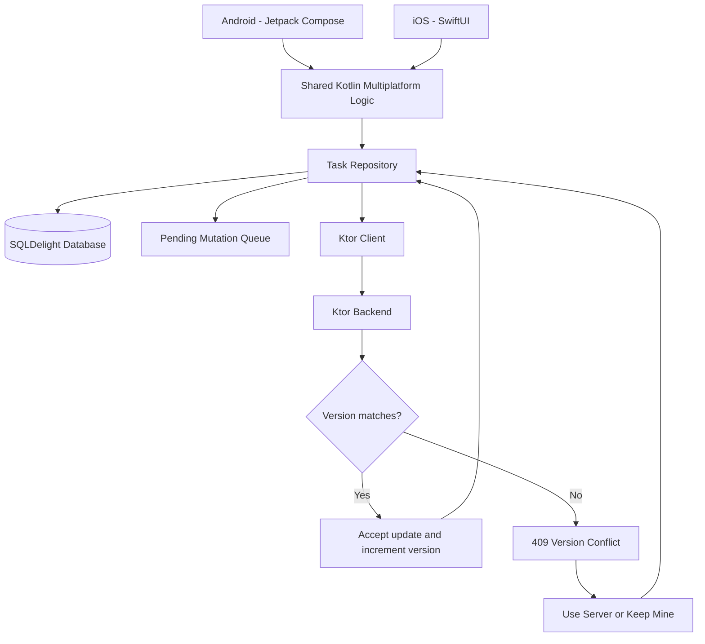

# SyncBoard

SyncBoard is an offline-first cross-platform task synchronization app built with Kotlin Multiplatform.

It includes:

- Native Android UI with Jetpack Compose
- Native iOS UI with SwiftUI
- Shared Kotlin business and synchronization logic
- SQLDelight local persistence
- Durable offline mutation queue
- Ktor client and backend
- Optimistic concurrency control
- Conflict detection and resolution
- Automatic retry of pending changes
- GitHub Actions CI for Android, backend, shared tests, and iOS

## Core idea

SyncBoard lets users update tasks even when connectivity is unreliable.

Changes are saved locally first, then synchronized with the server. If another client has already changed the same task, SyncBoard detects the version conflict instead of silently overwriting data.

The user can then choose:

- **Use server** — accept the latest server version
- **Keep mine** — rebase the local change and retry it

## Tech Stack

- Kotlin Multiplatform
- Jetpack Compose
- SwiftUI
- SQLDelight
- Ktor
- Koin
- Kotlin Coroutines
- Java 21
- GitHub Actions

## Architecture

Android and iOS use native user interfaces while sharing synchronization, persistence, networking, and domain logic through Kotlin Multiplatform.
